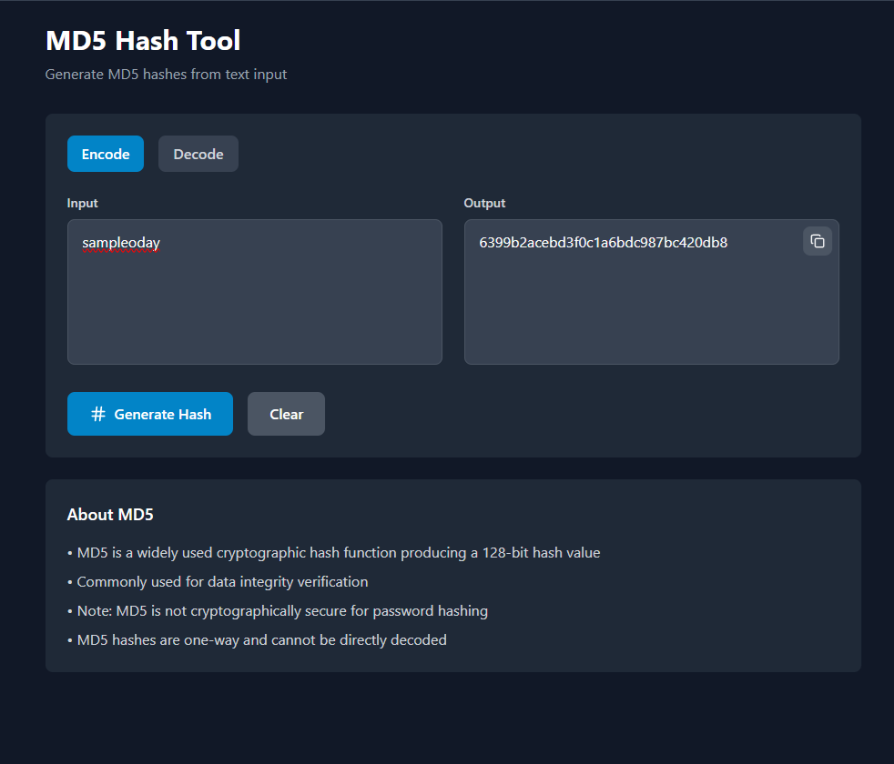

# 🛡️ CyberSec Platform

A comprehensive, modern cybersecurity tools platform built with React and TypeScript. This open-source project provides a collection of essential security tools with a sleek, dark-themed interface designed for cybersecurity professionals, researchers, and enthusiasts.

### Reconnaissance Tools
- **Subdomain Finder**: Discover subdomains using certificate transparency logs (crt.sh API)
  - Real-time subdomain enumeration
  - Export results to TXT format
  - Direct links to discovered subdomains
  
- **Whois Lookup**: Get comprehensive domain registration information
  - Domain ownership details
  - Registration and expiry dates
  - Name server information
  
- **DNS Lookup**: Query various DNS record types
  - A, AAAA, MX, NS, TXT, CNAME records
  - Comprehensive DNS information display
  
- **Reverse IP Lookup**: Find all domains hosted on a specific IP address
  - Discover related websites
  - Shared hosting environment analysis
  
- **IP Geolocation**: Locate IP addresses geographically
  - Country, region, and city information
  - ISP and organization details
  - Latitude and longitude coordinates
  
- **Port Scanner**: Scan for open ports on target hosts
  - Common port presets
  - Service identification
  - Real-time scanning progress

### 🔐 Encoding/Decoding Tools
- **MD5 Tool**: Generate MD5 hashes from text input
  - One-way hash generation
  - Copy to clipboard functionality
  
- **Base64 Tool**: Encode and decode Base64 strings
  - Bidirectional conversion
  - UTF-8 support
  
- **SHA Tool**: Multiple SHA algorithm support
  - SHA-1, SHA-256, SHA-512
  - Simultaneous hash generation
  
- **URL Tool**: URL encoding and decoding
  - Safe URL parameter handling
  - Special character conversion
  
- **HEX Tool**: Hexadecimal encoding and decoding
  - Text to hex conversion
  - Binary data representation
  
- **ROT13 Tool**: Classic Caesar cipher implementation
  - Letter substitution cipher
  - Self-inverse transformation

### 💻 Code Obfuscation
- **Python Obfuscator**: Real-time Python code obfuscation
  - Variable name randomization
  - Live preview functionality
  - Sample code templates
  
- **PHP Obfuscator**: PHP code obfuscation with instant preview
  - Function name obfuscation
  - Comment injection
  - Real-time processing

### Security Tools
- **Password Generator**: Create secure, customizable passwords
  - Adjustable length (4-100 characters)
  - Character type selection
  - Strength indicator
  - Exclude similar characters option
  
- **Hash Cracker**: Educational hash cracking tool
  - Dictionary attack simulation
  - MD5, SHA-1, SHA-256 support
  - Common password wordlist

## Screenshots

|  |  |
|:--:|:--:|
|  |  |

|  |  |
|:--:|:--:|
|  |  |

|  |  |
|:--:|:--:|
|  |  |

|  |  |
|:--:|:--:|
|  |  |
---

  
Made with ❤️ by <a href="https://github.com/odaysec">OdaySec</a>

  
⭐ Star this repository if you find it helpful!

